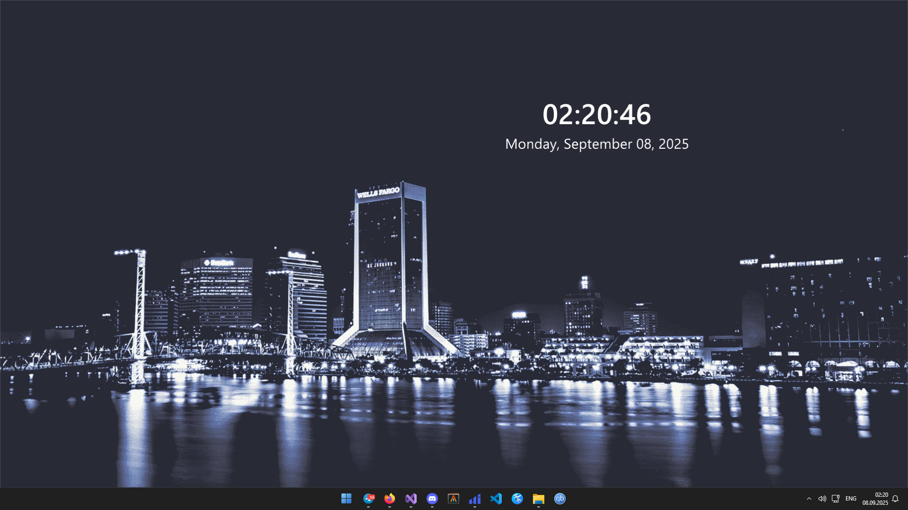

# ImProgman

Simple non-interactive background widget for Windows Explorer Desktop (Progman Window).

It uses **ImGui/OpenGL/Win32** under the hood.

This software is **Windows-only** and requires **Visual Studio 2019** or later with C++ Desktop Development package installed.

